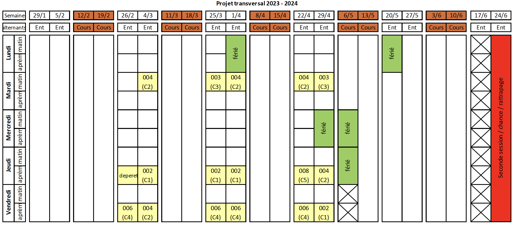

# Mif10 Projet transversal de master informatique 2023-2024

Cette UE vise à développer les capacités de travail collaboratives, tout en mettant en pratique les connaissances acquises dans les autres UE du M1.

Encadrants :
- Sylvain Brandel (responsable de l'UE, orga, support),
- Emmanuel Coquery (support BD),
- Lionel Médini (support prog web).

## Organisation de l'UE

Il s'agit de mener un projet de développement Web en groupe de 6 personnes. Le temps de travail attendu par étudiant est de **60 heures** réparties sur 6 semaines

L'UE se déroule pendant les périodes "creuses". Nous avons bloqué des créneaux, mais vous êtes libres dans votre organisation.
L'UE se déroulera en présentiel, vous devrez vous rencontrer pour travailler en groupe, tout en permettant que des personnes à distance puissent participer de manière fluide au projet.

Si vous avez des questions techniques ou organisationelles, elles se discuteront de manière publique via des ["issues" gitlab](https://forge.univ-lyon1.fr/mif10-2023/projet-transversal/-/boards) pour que tous les groupes puissent bénéficier des réponses.

Nous offrons une séance de permanence plusieurs fois par semaine (voir le calendrier), idéalement pour un groupe tout entier. Cela peut être l'occasion de discuter d'organisation, du cadrage du projet, de l'architecture, ou de problèmes techniques spécifiques.

Nous n'utiliserons pas l'email ou le chat pour répondre aux questions techniques. Vous pouvez toutefois m'envoyer un email :
- Si une réponse tarde à arriver dans les issues (pas de réponse après 36h, WE et jours fériés exclus),
- Si vous souhaitez discuter de l'organisation de votre groupe ou de points plus personnels (difficulté à suivre, tensions dans le groupe, attitude de personnes dans le groupe).

## Permanences

Pendant les semaines de projet il y aura trois créneaux résevés par semaine dans une salle du Nautibus, partiellement avec permanences :
- Mardi 9h45-13h,
- Jeudi 14h-17h15,
- Vendredi 14h-17h15.

## Cours

- Intro à l'UE [supports pdf](https://forge.univ-lyon1.fr/mif10-2023/projet-transversal/-/blob/main/cours/Mif10.pdf)
- Intro à Gitlab pour la gestion de projet
- Gestion de projet à distance

## Projet

Le thème général pour cette année est la création d'une application Web permettant d'évaluer votre **bilan CO2 quotidien** en fonction de vos habitudes : trajet domicile - travail, télétravail, style d'alimentation, loisirs / vacances... 
Il peut par exemple s'agir de connaître le bilan carbone par jour et par personne durant une semaine de ski dans les Alpes au départ de Lyon en voiture à quatre personnes, durant une semaine sur un paquebot de croisière au départ de Venise avec un trajet en avion depuis Lyon, lors du travail avec trajets à vélo ou en voiture, lors du télétravail...

Les cas d'usage spécifiques seront à spécifier au sein de votre groupe d'ici la fin de la 1e semaine. Vous pouvez proposer un sujet qui rentre dans ce cadre :
- Site grand public géré par des experts
- Site grand public en crowdsourcing
- Site à destination de personnes souhaitant faire des simulations à l'échelle d'une région ou d'un pays
- ...

Techniquement, votre application devra s'appuyer sur une base de données contenant _a minima_ des informations sur les modes de calcul du bilan carbone dans une situation particulière et pouvant être mise à jour par certains utilisateurs (administrateurs), mais également toute autre information nécessaire à la réalisation des cas d'utilisation que vous aurez choisis. L'interaction avec l'application se fera à travers une interface web.

## Étapes de l'UE, jalons et rendus intermédiaires

Les rendus se font sur le wiki de projet gitlab

### Semaine 1 (26/02) - Lancement du projet (5h de travail attendu)

- Création des groupes
- Mise en place des outils de collaboration
- Choix du sujet
- Jalon 0 :
  - Groupe Gitlab créé
  - Projet Gitlab créé
  - Wiki:
    - Page de garde créée qui organisera le contenu au fur et à mesure du projet
    - Page de équipe créée avec la liste des membres du projet (Nom, prénom, email, _téléphone_) + lien vers le salon privé de l'équipe
  - Enseignants de l'UE rajoutés comme rapporteurs au projet Gitlab.

### Semaine 2 (4/03) - Organisation et conception (10h de travail attendu)

- Organisation du travail de groupe
- Phase de conception orientée-usages
- Choix technologiques et mise en place des environnements de développements sur vos machines personnelles
- Jalon 1 :
  - Modalité de travail en groupe (page équipe du wiki mise à jour en fonction)
    - Rôles dans l’équipe,
    - Organisation interne définie
  - Objectifs et cible utilisateur définie (2 ou 3 paragraphe sur la page d'accueil du wiki)
  - Partie UX sur le wiki:
    - Cas d’utilisations principaux de l'application (ensemble de user stories)
    - Maquettes écrans de l'application (restez simple, il faudra les coder plus tard)
  - Des issues décrivant les user stories (si ce n'est pas sur le wiki).

### Semaine 3 (25/03) - Stack et démarrage (10h de travail attendu)

- Démarrage technique
- Mise en place de la VM
- Mise en place des scripts de CI/CD
- Mise en place de SonarQube
- Jalon 2 :
  - Test individuel (manuel) de chaque élément de l'architecture
  - Déploiement d'un "Hello world" permettant d'afficher une entrée (simple) de la base de données dans l'interface web.
  - Maj du wiki avec pointeurs techniques
    - How-to intégration continue pour tous les membres de l'équipe.
    - Outils et frameworks/bibliothèques utilisées par le groupe
    - 1e jet d’architecture (qui sera mis à jour au fur et à mesure)

### Semaine 4 (1/04) - Proto 1 “[MVP](https://en.wikipedia.org/wiki/Minimum_viable_product)” (15h de travail attendu)

- Une version 0 de l'application est testable sur la VM
- Jalon 3 :
  - Chaîne d’outillage fonctionnelle (Intégration continue : construction, tests, qualité, déploiement)
  - UNE fonctionnalité de base est implémentée et intégrée.

### Semaine 5 (22/04) (15h de travail attendu)

- Développement et tests

### Semaine 6 (29/04) — Livraison et présentation (10h de travail attendu)

- Finalisation (pas d’ajout de fonctionnalités)
- Livraison du code
- Démo sur VM
- Soutenances
- Jalon 4 :
  - Guide d'utilisation sur le wiki
  - MàJ de l'architecture
  - Documentation technique

Rendus et soutenances : voir plus bas.

## Rôle au sein du groupe

Nous suggérons de définir les rôles suivants dans le groupe

- Spécialiste VM et de l'intégration
- Spécialiste back-end
- Spécialiste front
- Spécialiste qualité et testing
- Spécialiste produit (choix de design, cohérence de l'application), UX/UI
- Spécialiste suivi de la progression, reporting, cohérence de l'équipe.

Ces rôles ne sont pas exclusifs (on peut en partager les rôles à deux personnes par exemple en se répartissant les tâches).

## Stand-up et travail à distance

En plus des séances qui se dérouleront en présentiel, l'UE est pensée pour de l'hybride et du distanciel. Il faut qu'une personne qui serait ponctuellement absente puisse suivre de manière fluide à distance, ou rattraper facilement son retard. Il faut aussi pouvoir consulter les archives des compte-rendus des réunions passées. Cela veut dire que toute information échangée doit être accessible par les membres du groupe, et stockée de manière pérenne.

En termes pratiques nous attendons de chaque groupe :

- 3 stand-ups dans la semaine **à heure et lieu (virtuel ou physique) fixe** (_a minima_).
  - Le stand-up du début de semaine doit contenir une activité de planification des tâches de la semaine via des issues gitlab.
  - Un stand-up de milieu de semaine qui peut être rapide.
  - Le stand-up de fin de semaine suivi d'un retro, qui fait le bilan des tâches réalisées, de celles qui ne l'ont pas été et du pourquoi.
- une définition de toutes les tâches à réaliser dans une issue gitlab (en mode 'Board' pour leur suivi), cela inclut les tâches non techniques (rapports, gestion du serveur, UI, etc.), les tâches doivent être mises à jour au fur et à mesure de la progression en suivant une approche kanban.
- un commit (avec description) pour chaque tâche réalisée.

## Rendus chaque semaine

À la fin de chaque mêlée (1 semaine) nous attendons un bilan sur une page dédiée du wiki avec:

- Liens vers les notes des réunions
- Présents/absents aux stand-ups de la semaine
- Résumé de l'avancement
  - Points de blocage technique et/ou humains
  - États des issues en début et fin de semaine (screenshots de l'état du board en début et fin de semaine)
  - État de la qualité
  - Screenshots Sonarqube (à partir de la semaine 4).

## Outils à utiliser:

- Gitlab pour le code, mais aussi pour la gestion des tâches, et pour les rendus des jalons.
- Gitlab issues pour les questions techniques ouvertes à tous les groupes, votre groupe utilisera les issues de son projet pour les discussions internes.
- Le wiki de Gitlab pour gérer l'information relative au projet.
- RocketChat pour les échanges de coordinations ou les questions pratiques. Nous décourageons fortement Discord ou Messenger que vous utilisez déjà pour d'autres activités (fermez les quand vous travaillez!!!).
- Un outil de visio (type jitsi) pour les réunions d'équipe à distance, ou même des sessions de codage collaboratives.

## Évaluation

Le projet sera évalué en trois pans:

- Rendus intermédiaires
- [Présentation et démo](eval-enseignants.md)
- Qualité technique du code
- [Évaluation entre pairs](eval-pairs.md)

L'évaluation par les pairs aura un effet modulateur +1/0/-1 sur la note de groupe. L'équipe enseignante aura aussi la possibilité de rajouter un bonus/malus entre +2 et -2. Les notes au sein d'un groupe peuvent donc varier de -3 à +3.

## Rendu Final

- Le rendu du code est pour le mardi **30 avril 23h59**
- Le wiki peut être mis à jour jusqu'au jeudi **2 mai 12h00**
- L'évaluation entre pairs est à réaliser avant le vendredi **3 mai 23h59**

- Mettre les intervenants de l'UE (Sylvain Brandel, Emmanuel Coquery, Lionel  Médini) comme reporters de votre projet
- Créer une branche FINAL correspondant au code de la démo
  - Qui datera au plus tard du jour du rendu le **30 avril**
- README.md détaillant les dépendances, la procédure de build, et le lien vers la VM de démp
- Un wiki structuré qui contient les rendus intermédiaires et les notes de réunions.
- Le wiki décrira aussi le processus de gestion qualité
  - Tests, et leur gestion (qui écrit, qui teste, etc.)
  - Description des processus automatisés (mis en place ou essayé)
  - Rapports des tests utilisateurs
  - Captures intermédiaires de la qualité (avec Sonarqube)
- Le wiki aura une page dédié à la démo :
  - Lien vers la VM de démo
  - Instructions d'utilisations

## Démonstration et Présentation

### Déroulé des soutenances

Les soutenances durent 25 minutes elles sont divisées en

- 15 minutes de présentation et démo
- 10 minutes de questions

La durée de présentation est stricte (15 minutes), vous serez interrompus si vous dépassez.

Nous vous invitons à partager la parole de manière équilibrée au sein du groupe.

### Conseils de présentation

L'objectif de la présentation est de montrer votre réalisation (sous forme de démo), vos choix techniques, et votre organisation de groupe.

**Démonstration**

- Préparer un scénario de démonstration, et déroulez-le.
- Mettre en avant les points forts de la réalisation aussi bien technique, qu'en termes d'usage.
- Discuter des compromis que vous avez dû faire, et de vos choix finaux en termes de fonctionalités, d'interface, de sécurité, etc.

**Présentation**

Présenter :

- votre mode de fonctionnement collaboratif
- vos choix d'architecture, quelques diagrammes UML, les patterns utilisés, etc.
- vos méthodes et outils de suivi et de déploiement du code
- les résultats de votre [rétrospective Agile](https://www.nutcache.com/fr/blog/learning-matrix-iteration-agile/) (Les points positifs, Les points à améliorer, Les « merci ! », Les idées d’amélioration)
- les leçons que vous retenez du projet

Nous valorisons la prise de recul critique sur ce que vous avez appris, et comment vous vous organiserez mieux la prochaine fois, que ce soit en termes techniques ou de travail de groupe.

### Passage des groupes:

#### Jeudi 2 mai

Jury: Sylvain Brandel, Emmanuel Coquery

- 13h00 : Groupe ?
- 13h30 : Groupe ?
- 14h00 : Groupe ?
- 14h30 : Groupe ?
- 15h00 : Groupe ?
- pause
- 16h00 : Groupe ?
- 16h30 : Groupe ?
- 17h00 : Groupe ?
- 17h30 : Groupe ?

#### Vendredi 3 mai

Jury: Sylvain Brandel, Lionel Médini

- 13h00 : Groupe ?
- 13h30 : Groupe ?
- 14h00 : Groupe ?
- 14h30 : Groupe ?
- 15h00 : Groupe ?
- pause
- 16h00 : Groupe ?
- 16h30 : Groupe ?
- 17h00 : Groupe ?
- 17h30 : Groupe ?

